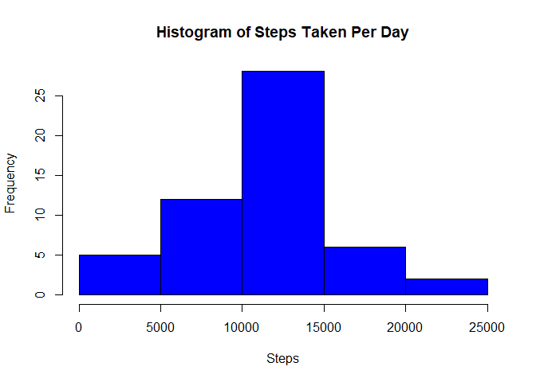
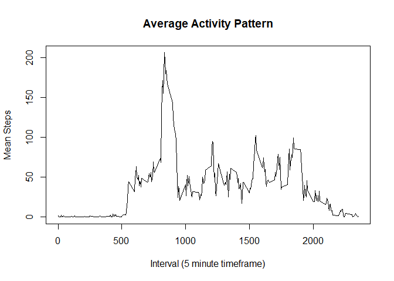
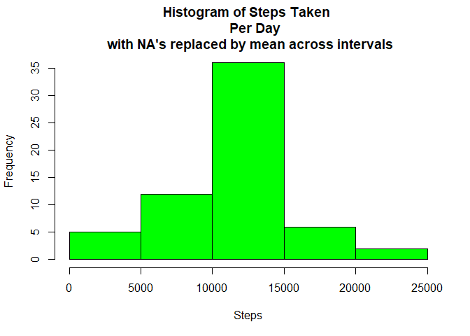
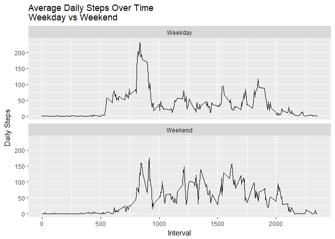

  
## Loading and Preprocessing the Data
Dataset: Activity monitoring data [52K] https://d396qusza40orc.cloudfront.net/repdata%2Fdata%2Factivity.zip
The variables included in this dataset are:

steps: Number of steps taking in a 5-minute interval (missing values are coded as NA)

date: The date on which the measurement was taken in YYYY-MM-DD format

interval: Identifier for the 5-minute interval in which measurement was taken

The dataset is stored in a comma-separated-value (CSV) file and there are a total of 17,568 observations in this dataset.

```r
getwd()
```

```
## [1] "C:/Users/Betsy/Documents/CD continuing education/2017/data science/RWorkingDirectory/ActivMonTest"
```

```r
##hide warnings and messages when loading library(package)
knitr::opts_chunk$set(warning=FALSE,message = FALSE)
actdata<-read.csv("activity.csv")
actdatasum<-aggregate(actdata$steps, by=list(Date=actdata$date), FUN=sum)
```


## Part 1: What is the total number of steps taken per day?
Note: do not need to scrub data for part 1

### 1a) Create a histogram of the total number of steps taken per day 

```r
hist(actdatasum$x, col="blue", xlab="Steps", main="Histogram of Steps Taken Per Day")
```

<!-- -->
  
### 1b) Calculate the mean and median total number of steps taken per day

```r
meansteps<-mean(actdatasum$x, na.rm=TRUE)
mediansteps<-median(actdatasum$x, na.rm=TRUE)
```
The mean steps per day (removing NA's) is 10,766 and the median is 10,765.
  
    
## Part 2: What is the average daily activity pattern?
Note: do not need to scrub data for part 2

### 2a) Create a time series plot (type = 'l') of the 5-minute interval (x-axis) and avg
number steps taken, averaged across all days (y-axis)    

```r
actdatatime<-aggregate(actdata$steps, by=list(Interval=actdata$interval), 
        FUN=mean, na.rm=TRUE)
plot(x=actdatatime$Interval,y=actdatatime$x, type="l", 
     xlab="Interval (5 minute timeframe)",ylab="Mean Steps", 
     main = "Average Activity Pattern")
```

<!-- -->
  
### 2b) Which 5-minute interval, on average across all days in the dataset, contains
the maximum number of steps?

```r
maxint<-actdatatime$Interval[which.max(actdatatime$x)]
```
The interval with the maximum average steps per day (removing NA's) is 835
, with step count of 206.


## Part 3: Imputing missing values
### 3a) What is the count of rows with NA's?  

```r
countNA<-sum(is.na(actdata))
```
The total number of rows with NA's in the original dataset is 2304.
  
### 3b) create a new dataset by replacing the NA's with with the mean across all intervals. 
The average of the mean steps by interval is 37.  
Create a new dataset with NA's replaced with mean by interval.

```r
actdata2<-actdata
actdata2[is.na(actdata2)] <- mean(actdatatime$x)
actdata2sum<-aggregate(actdata2$steps, by=list(Date=actdata2$date), FUN=sum)
```

  
### 3bi) Create a histrogram of the total number of steps taken each day

```r
hist(actdata2sum$x, col="green", xlab="Steps", main="Histogram of Steps Taken 
     Per Day \n with NA's replaced by mean across intervals")
```

<!-- -->
  
### 3bii) Calculate the mean and median of the total number of steps taken each day.
How do these values differ from the estimates in part 1?  What is the impact of
imputing missing data on the calculated estimates?

```r
meanstepsadj<-mean(actdata2sum$x, na.rm=TRUE)
medianstepsadj<-median(actdata2sum$x, na.rm=TRUE)
```
  
The mean steps in the adjusted dataset is 10,766 and the median is 10,766.  This is not materially different than the dataset 
with NA's. In this case, imputing a mean had little to no impact.
  
## Part 4: Are there differences in activity patterns between weekdays and weekends?
Note: use the dataset from 2i. Create a new factor variable with two levels 
"weekday" and "weekend".  

```r
library(dplyr,warn.conflicts = FALSE)
actdata$date <- as.character(actdata$date)
actdata$date <-as.POSIXct(actdata$date, format="%Y-%m-%d")
##day of the week
actdata<- mutate(actdata, day = weekdays(date))
##T/F column indicating weekend
actdata$wknd<-actdata$day %in% c("Saturday", "Sunday")
actdatatime<-aggregate(actdata$steps, by=list(Interval=actdata$interval,IsWknd=actdata$wknd), FUN=mean, na.rm=TRUE)
```


  
### 4a) make a panel plot containing a time series plot (type = "l") of the 5-minute 
interval (x-axis) and the number of steps taken, averaged across all weekday days
or weekend days (y-axis).
  

```r
library(ggplot2)
labels <- c("TRUE" = "Weekend", "FALSE" = "Weekday")
ggp2<-ggplot(data=actdatatime,aes(x=Interval,y=x))
##now set it up to save (g) and print ggplot object
##add layers 
g2<-ggp2+
        geom_line()+
        ggtitle("Average Daily Steps Over Time \nWeekday vs Weekend")+
        ylab("Daily Steps")+ 
        facet_wrap(~IsWknd, ncol = 1, labeller = labeller(IsWknd=labels))
print(g2)
```

<!-- -->
 
A greater number of steps is achieved on the weekends.

